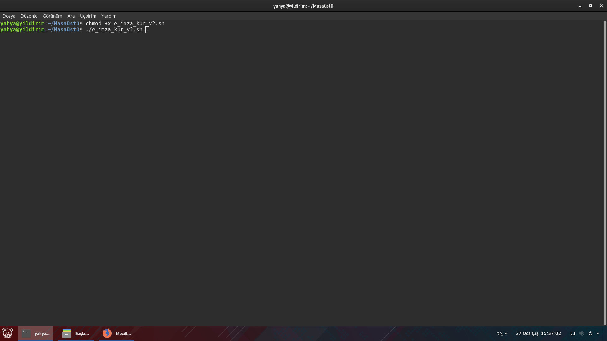
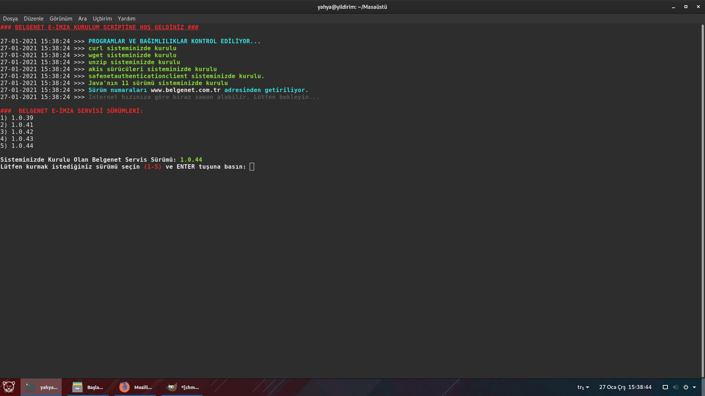
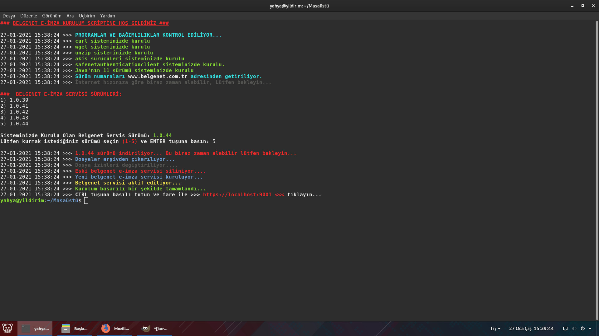
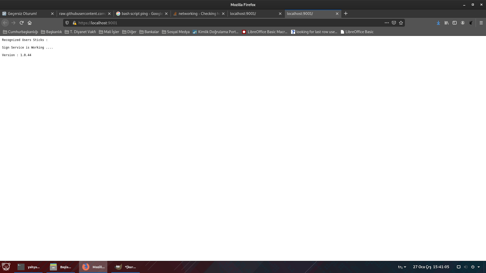
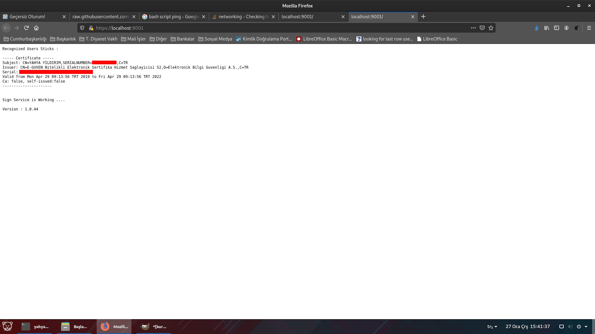

# HAKKINDA
Bu Script, Pardus yüklü cihazlarda e-imza sürücülerinin yüklenmesini otomotize etmek için hazırlanmıştır. Kişisel Kullanım için hazırladım ancak herkesin istifadesine sunuyorum. Sizde dilediğiniz gibi kullabilirsiniz. Eksik ve yanlış yazdığım kodlar hakkında dönüş yaparsanız memnun olurum.

# SCRİPT İLE;
1. Sisteminizde Akis Kart Sürücüsü yüklü değilse yüklenecek,
2. Safenet Kart Sürücüsü Yüklü değilse yüklenecek. (Öntanımlı olarak kapalı, 149. satırda # işaretini kaldırmanız gerekiyor.)
3. Belgenet Tarayıcı Servisi (Applet) yüklü değilse, seçim ekranından istediğiniz versiyonu yükleyebilecek.
4. unzip, wget ve curl kurulu değilse kuracak. (Scriptin çalışması için gereklidir.)
5. Java kurulu değilse depolarda arayacak, varsa kuracak yoksa herhangi bir işlem yapmayacak. Ancak java olmadan e-imza çalışmayacaktır.
6. Script Pardus 19, 21 ve 23 Sürümlerinde (XFCE ve GNOME) denenmiştir.

# KURULUM:
* Uçbirim/Terminal açarak aşağıdaki kodları sırayla çalıştırın.
* `wget --no-check-certificate O- https://github.com/yahyayildirim/belgenet_e_imza_kur/raw/main/e_imza_kur_v2.sh`
* `chmod +x e_imza_kur_v2.sh` yazın ve ENTER'a basın.
* sonra `./e_imza_kur_v2.sh` yazarak ENTER tuşuna basın.
* Sizden yönetici parolası isteyecektir. Parola girdiğinizde ekranda hernagi bir şey görünmeyeceği için siz şifrenizi doğru bir şekilde girin ve ENTER tuşuna basın.
### > EKRAN GÖRÜNTÜSÜ-1:

### > EKRAN GÖRÜNTÜSÜ-2:

### > EKRAN GÖRÜNTÜSÜ-3:

### > EKRAN GÖRÜNTÜSÜ-4:

### > EKRAN GÖRÜNTÜSÜ-5:

